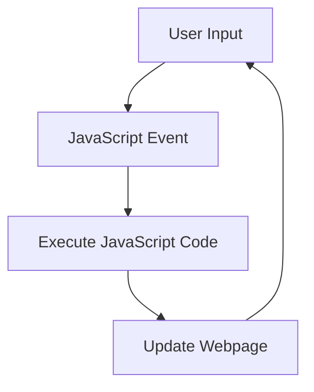

# 1. Definition of JavaScript and Its Uses

JavaScript (JS) is a lightweight, interpreted programming language used to create interactive effects within web browsers. It enables dynamic content, allowing web pages to be more engaging and functional. JS is versatile and can also be used on the server-side with environments like Node.js.

## Why JavaScript Is Used:

- **Client-Side Interactivity**: Makes websites interactive by responding to user inputs, like button clicks.
- **Form Validation**: Performs validation in the browser before sending data to the server.
- **Dynamic Page Updates**: Modifies the content of a web page without reloading it (e.g., using AJAX).
- **Server-Side Development**: With Node.js, JavaScript can be used to create full-stack applications.

---

# 2. How and Where Can We Run JavaScript

JavaScript can be run in:

- **Web Browsers**: All modern web browsers (like Chrome, Firefox, Edge) have built-in JavaScript engines that execute the code.
- **Node.js**: A runtime that allows JavaScript to run on servers.
- **Development Tools**: Using online editors (e.g., JSFiddle, CodePen) or within browser developer tools.

---

# 3. Seven Data Types in JavaScript

JavaScript has seven primary data types:

| Data Type | Description                                         | Example Usage                  |
| --------- | --------------------------------------------------- | ------------------------------ |
| Number    | Represents both integer and floating-point numbers. | `let age = 25;`                |
| String    | Sequence of characters used for text.               | `let name = "John";`           |
| Boolean   | Represents logical true or false values.            | `let isActive = true;`         |
| Undefined | Variable that has been declared but not assigned.   | `let x; // x is undefined`     |
| Null      | Represents the intentional absence of any value.    | `let data = null;`             |
| Object    | Collection of key-value pairs.                      | `let person = {name: "John"};` |
| Symbol    | Unique, immutable values primarily for object keys. | `let sym = Symbol("id");`      |

---

# 4. Declaring Variables (var, let, const)

- **var**: Declares variables globally or locally to an entire function.

  ```javascript
  var x = 5;
  ```

- **let**: Declares block-scoped variables, meaning the variable is limited to the block, statement, or expression.

  ```javascript
  let y = 10;
  ```

- **const**: Declares block-scoped, read-only variables (constant). The value of a `const` variable cannot be reassigned.

  ```javascript
  const z = 15;
  ```

---

# 5. Arithmetic Operations in JavaScript

JavaScript provides various arithmetic operators:

- **Addition**: `let sum = 5 + 3;`
- **Subtraction**: `let difference = 5 - 3;`
- **Multiplication**: `let product = 5 * 3;`
- **Division**: `let quotient = 5 / 3;`
- **Remainder (Modulo)**: `let remainder = 5 % 3;`

---

# 6. Escape Characters in JavaScript

Escape characters allow you to include special characters in strings. Common escape sequences:

- **Double Quotes (`"`)**: `let str = "He said, "Hello!"";`

- **Single Quotes (`'`)**: `let str = 'It's a great day!';`

- **Backticks (`\`)**: Used for multi-line strings and string interpolation with variables.

  ```javascript
  let name = "John";
  let greeting = `Hello, ${name}!`;
  ```

---

# 7. Strings and String Operations

- **Concatenation**: Combine two or more strings using the `+` operator or `concat()` method.

  ```javascript
  let fullName = "John" + " " + "Doe";
  ```

- **Adding Strings**: Similar to concatenation, but can also involve other expressions.

  ```javascript
  let greeting = "Hello, " + name + "!";
  ```

---

# 8. String Length and Immutability

JavaScript strings are immutable, meaning their characters cannot be changed directly:

```javascript
let str = "jello";
// str[0] = "h"; // This does not work.
str = "hello"; // Instead, you create a new string.
```

- **Length of a String**: Use the `length` property to find the length.

  ```javascript
  let len = str.length;
  ```

---

# 9. Accessing Characters in Strings

- **Accessing the Last Character**: Use `str.length - 1` to get the last character.

  ```javascript
  let lastChar = str[str.length - 1]; // Last character
  let thirdLastChar = str[str.length - 3]; // Third last character
  ```

---

**Flowchart of JavaScript Execution**:



